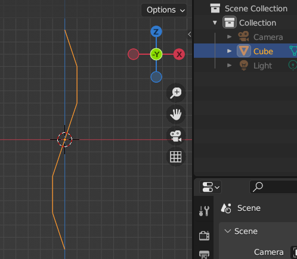

# Braid

## 1. Create vertex in the center of the world

- select the default cube
- edit mode, vertex select mode
- select everything
- merge at center

## 2. Make line out of the vertex

- set front viewpoint(NumPad `1`)
- enable snap to increment

  

- extrude the vertex as shown below

  

- set side viewpoint(NumPad `3`)
- move vertices as shown below

## 3. Duplicate it and mirror by all axis

- set front viewport(NumPad `1`)
- exit Edit mode(`Tab`)
- duplicate(`Shift + D, Enter`)
- mirror in Y plane(`Ctrl + M, Shift + Y, Enter`)
- show last operation menu and select missing Y(`F9`, click on Y)

- select two meshes
- join them(`Ctrl + J`)

## 4. Connect duplicates in the point of touch

- enter Edit mode(`Tab`)
- turn on X-ray(`Alt + Z`)
- select the middle point, where two lines touch each other
- mergre by distance(`M`, click By Distance)
- turn off X-ray(`Alt + Z`)

## 5. Duplicate and move Z on 1/3 twice

- exit Edit mode
- add Array modifier:
    - Count: 3
    - Relative offset: checked
    - factor X and Y: 0
    - factor Z: 0.333333

- apply modifier(mouse over modifier, `Ctrl + A`)

## 6. Cut off uneven part and connect to the other end

- enter Edit mode(`Tab`)
- select uneven part as shown

- rip one line(`Alt + V, Enter`)
- rip another(`Alt + V`, don't confirm)
- move down Z to complete(`Z`, move, confirm)
- select all(`A`)
- merge by distance(`M`, By Distance)

## 7. Make desireable length

- exit Edit mode(`Tab`)
- turn off Snap
- add Array modifier:
    - count: at your taste
    - factor X = Y = 0
    - factor Z = 1
    - merge: true
- if you like it, apply the modifier(mouse over modifier, `Ctrl + A`)

## 8. Set origin at the top

- enter edit mode(`Tab`)
- vertices select mode
- select top center vertex
- snap 3D Cursor there(`Shift + S`, Cursor to Selected)
- leave edit mode(`Tab`)
- Set Origin to 3D Cursor(`Right Click`, Set Origin, Origin to 3D Cursor)

## 9. Convert to Curve and set Bevel

- convert to Curve(`Right Click`, Convert To, Curve)

- go to Object Data Props, Geometry, Bevel, Round
- set Depth to 1mm or at your taste

- shade smooth(`Right Click`, Shade smooth)
- add Subdivision modifier(`Ctrl + 1`)

## 10. Spread strands from top end for more natural look

- enter Edit mode, Vertices
- enable Proportional Editing(`O`)
- select top three points
- scale on X(`S, X`)
- scroll so Proportional Editing affects full length of the braid
- get similar to shown below and confirm operation

## 11. Make strands thicker at the top and thinner at the bottom

- leave Edit Mode(`Tab`)
- make sure Proportional Editing is disabled(`O`)
- add Bezier Curve(`Shift + A`, then Curve, Bezier)
- rotate X 90°(`R, X, 90, Enter`)
- move it aside(`G, X`, move) and scale(`S`) for your comfort, apply only scale and rotation(`Ctrl + A`, Scale)

- go to braid's object data and set Bezier as a Taper Object

- select Bezier and enter Edit mode
- make sure Proportional Editing is disabled
- now you can move ends of Bezier along Z, which will mean width of braid's strands at different length

## 12. Fix curve direction, if needed

- if a strand looks in opposite way: thin at the top, but thick at the bottom, fix it
- select braid and enter Edit mode
- select whole the problematic curve
- then switch direction(`Right click`, Switch direction)
- leave Edit mode

## 13. Make braid follow the path

- make sure 3D Cursor is at braid's origin
- add Path Curve(`Shift + A`, Curve, Path)
- add Curve modifier to braid
  - select Path as Curve object(braid moves to the -X)
  - deform axis: X

- set Origin of Path at the end, which inside braid(braid moves back to the +X)

- using 3D Cursor move Path, so it's Origin and braid's one will be at the same point

- rotate Path 90° around Y(`R, Y, 90, Enter`)
- turn on X-ray(`Alt + Z`)
- enter Edit mode
- set Pivot point to 3D Cursor
- select all and scale along Z, so length of Path will be equal to braid

- turn off X-ray

Now you can edit Path as you like, subdivide it if needed. The braid will follow the path.

