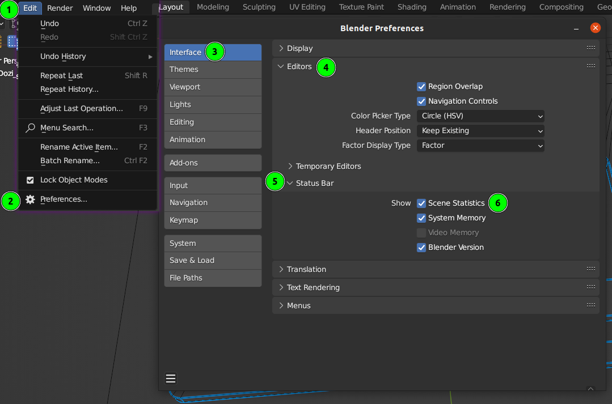
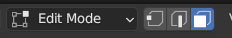
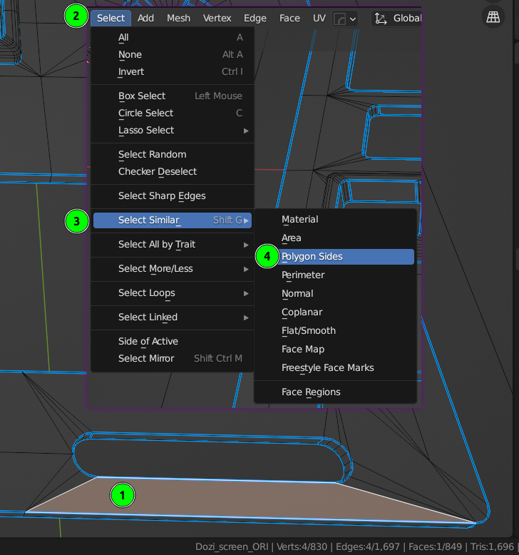
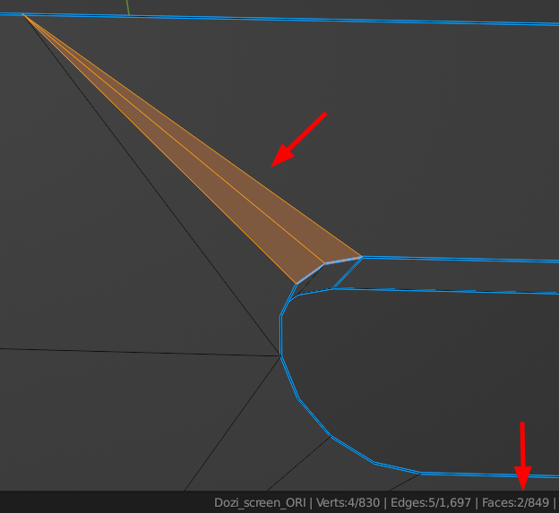

# Search non-quad faces

_«Quads… You got to make them out of polygons… Because there isn’t anything else to make them out of»_

_~~Robert Penn Warren~~ Web Architect_

## 1. Enable scene statistics in the status bar

- "Edit -> Preferences... -> Interface -> Editors -> Status Bar -> Show -> Scene Statistics"

## 2. Enter "Edit mode" of desired mesh object and select "Face select mode"

## 3. Find all quads

- Select any quad
- "Select -> Select Similar -> Polygon Sides" or `Shift + G`

## 4. Invert selection to find all non-quads

- "Select -> Invert" or `Ctrl + I`

**And here you are: problematic N-gons are captured and their count is displayed in the status bar!**

